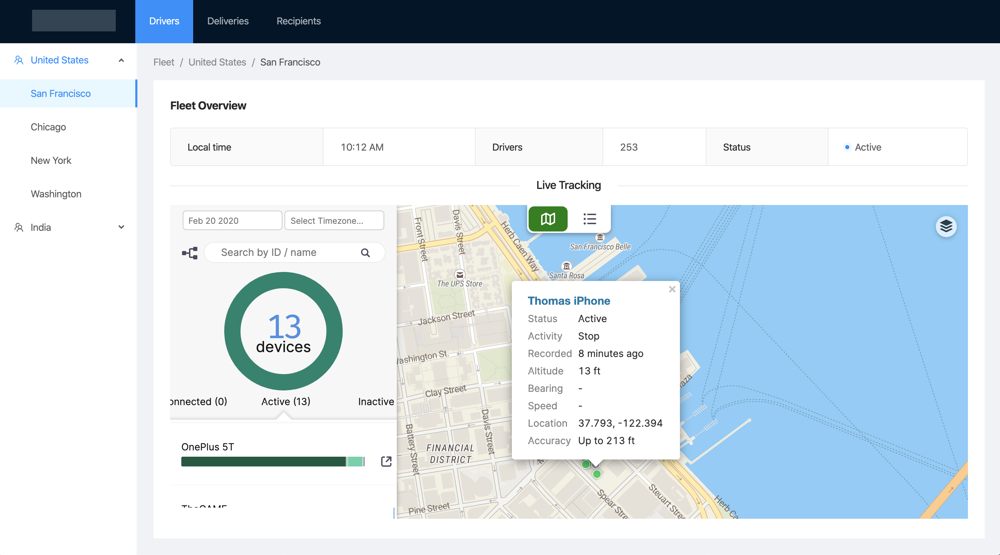

<a href="https://www.hypertrack.com/">
    
</a>

# Sample Frontend Integration: Placeline


Placeline is a ReactJS/NextJS sample application to track the movement of your mobile workforce through the workday. Use this web app to track the live location, activity, device status and places visited by your business assets; track summaries for drives, steps, places and inactive hours; drill down to device locations organized in activity segments for each day, and export selected segments to 3rd party applications such as expense management software.

> 💬 [Check out this blog post](https://hypertrack.com/blog/2019/09/09/open-sourcing-placeline-a-sample-app-to-track-the-movement-history-of-your-workforce/) to learn why this is important, how HyperTrack is using it internally, and how it all ties together with HyperTrack platform.

Placeline is built with HyperTrack Views.

## Overview

- [Sample Frontend Integration: Placeline](#sample-frontend-integration-placeline)
  - [Overview](#overview)
  - [Features](#features)
  - [Requirements](#requirements)
  - [Installation and setup](#installation-and-setup)
    - [Local setup](#local-setup)
    - [Heroku setup](#heroku-setup)
  - [Usage](#usage)
  - [Related](#related)
  - [Credits](#credits)
  - [License](#license)

## Features

| Dashboard                        |
| -------------------------------- |
|  |

- Embed HyperTrack Views in a dashboard
- Map the live locations of devices
- Search and browse live tracking status and days tracked
- Drill down to live tracking views and day’s history for each device
- Review tracking summaries for duration, distance, activities, and more
- Export tracking summaries

## Requirements

The goal of this project is to get you to a deployed integration in minutes. For this to work, you need to have:

- [ ] Set up a [HyperTrack account](https://dashboard.hypertrack.com/signup) and obtain your `AccountId` and `SecretKey` from the [Dashboard](https://dashboard.hypertrack.com/)
- [ ] Integrate the HyperTrack SDK in your mobile application ([iOS](https://github.com/hypertrack/quickstart-ios), [Android](https://github.com/hypertrack/quickstart-android), or [React Native](https://github.com/hypertrack/quickstart-react-native)) or use our sample app to send location data ([iOS](https://github.com/hypertrack/live-app-ios) or [Android](https://github.com/hypertrack/live-app-android))

## Installation and setup

You can install this project on your local machine and deploy it quickly to Heroku for free.

### Local setup

After cloning or forking this repository, you should install all dependencies on your machine:

```shell
# with npm
npm install

# or with Yarn
yarn
```

Next, you need to set your environmental variables. The project uses [dotenv](https://github.com/motdotla/dotenv), so it's best to create a `.env` file in the root folder of the project. This file is listed in `.gitignore` and shall not be checked into public repositories. Below is the content on the file - please ensure to replace the keys with your own:

```shell
# HyperTrack
HT_PUBLISHABLE_KEY = <HT_PUBLISHABLE_KEY>
```

With the dependencies and configuration in place, you can start the server in development mode:

```shell
# with npm
npm run dev

# or with Yarn
yarn dev
```

**Congratulations!** You just completed a web app for your HyperTrack integration.

### Heroku setup

This project is set up to be deployed to Heroku within seconds. You need a Heroku account. All you need to do is to click on the one-click-deploy button below. It will provide the following services and add-ons:

- Web Dyno - to run the server on Heroku (free)
- NodeJS buildpack - to run NextJS on Heroku (free)
- PaperTrail - hosted logging system (free)

Similar to the local setup, you need to have your keys ready before the deployment. The Heroku page will ask you for the following:

- `HT_PUBLISHABLE_KEY`: Your HyperTrack publishable key

You need to enter all of these keys for the project to run successfully. Heroku uses the input to pre-set the environmental variables for the deployment. You can change after the setup as well.

**Deploy this project now on Heroku:**

[](https://heroku.com/deploy?template=https://github.com/hypertrack/placeline-nextjs)

## Usage

Once the main page (_index.js_) is opened, it will load an embeddable view from HyperTrack to display all tracked devices. The HyperTrack View enables interaction, so drilling down onto a single device and its history is easily possible.

## Related

This web application is using [HyperTrack Views](https://docs.hypertrack.com/#guides-track-devices-with-the-api-embed-views-in-your-dashboard).

## Credits

This project uses the following open-source packages:

- [nextjs](https://github.com/zeit/next.js/): SSR React Framework
- [dotenv](https://github.com/motdotla/dotenv): Load environment variables from .env files
- [ant-design](https://github.com/ant-design/ant-design): An enterprise-class UI design language and React implementation

## License

This project is licensed under the MIT License - see the [LICENSE](LICENSE) file for details
