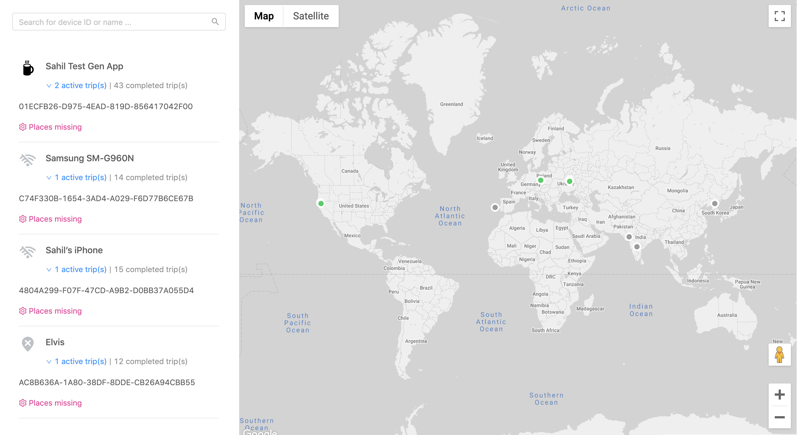
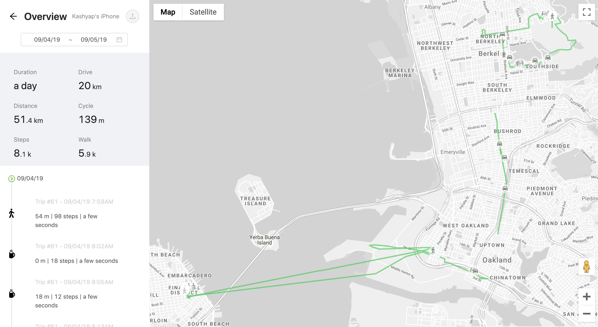
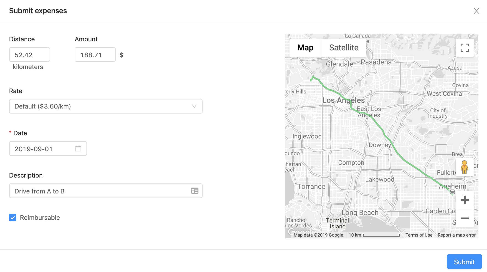

<a href="https://www.hypertrack.com/">
    
</a>

# Sample Frontend Integration: Placeline


Placeline is a ReactJS/NextJS sample application to track the movement of your mobile workforce through the workday. Use this web app to track the live location, activity, device status and places visited by your business assets; track summaries for drives, steps, places and inactive hours; drill down to device locations organized in activity segments for each day, and export selected segments to 3rd party applications such as expense management software.

Placeline is built with HyperTrack APIs, SDKs, webhooks and associated helper libraries (like the [sample backend NodeJS project](https://github.com/hypertrack/sample-backend-nodejs)).

<p align="center">
  
</p>

## Overview

- [Sample Frontend Integration: Placeline](#sample-frontend-integration-placeline)
  - [Overview](#overview)
  - [Features](#features)
  - [How it works](#how-it-works)
  - [Requirements](#requirements)
  - [Installation and setup](#installation-and-setup)
    - [Local setup](#local-setup)
    - [Heroku setup](#heroku-setup)
  - [Backend](#backend)
  - [Usage](#usage)
  - [Related](#related)
  - [Credits](#credits)
  - [License](#license)

## Features

Features of this sample application include:

<table>
  <tr>
    <th>View</td>
    <th>Features</td>
  </tr>
  <tr>
    <td><b>Devices Overview</b><br /></td>
    <td><ul>
      <li>Map the live locations of devices</li>
      <li>Search and browse live tracking status and days tracked</li>
      <li>Drill down to live tracking views and day’s history for each device</li>
      <li>Set geofences for home/work to track arrival/exits at those places of interest</li>
    </ul></td>
  </tr>
  <tr>
    <td><b>Single Device</b><br /></td>
    <td><ul>
      <li>Track movement organized in granular segments for selected days</li>
      <li>Review the location data of each segment on a map</li>
      <li>Track summaries for the tracked duration, distance, activities, places, steps and more</li>
      <li>Export driving segments to a 3rd party expense report</li>
    </ul></td>
  </tr>
  <tr>
    <td><b>Expense Report</b><br /></td>
    <td><ul>
      <li>Review the detailed location history on one map</li>
      <li>Review the distance, time, description, and expense amount based on a fixed rate</li>
      <li>Submit expense report and see a success confirmation</li>
    </ul></td>
  </tr>
</table>

## How it works

The project uses the NextJS and leverages file-system routing([read more](https://nextjs.org/docs#routing)). With that, the project structure looks like this:

- **/components**: HOC to be used within pages
- **/pages**: Navigatable pages and general setup for app/document
- **/static**: Statically served styles and images

## Requirements

The goal of this project is to get you to a deployed integration in minutes. For this to work, you need to have:

- [ ] A backend providing accessible REST APIs. [Get a sample NodeJS backend here](https://github.com/hypertrack/sample-backend-nodejs)
- [ ] A Google Maps API Key for the map component. [Read more.](https://developers.google.com/maps/documentation/javascript/get-api-key)
- [ ] A [Heroku account](https://signup.heroku.com/) for deployment

## Installation and setup

You can install this project on your local machine and deploy it quickly to Heroku for free.

### Local setup

After cloning or forking this repository, you should install all dependencies on your machine:

```shell
# with npm
npm install

# or with Yarn
yarn
```

Next, you need to set your environmental variables. The project uses [dotenv](https://github.com/motdotla/dotenv), so it's best to create a `.env` file in the root folder of the project. This file is listed in `.gitignore` and shall not be checked into public repositories. Below is the content on the file - please ensure to replace the keys with your own:

```shell
# Google Maps
GMAPS_KEY = <YOUR_GOOGLE_MAPS_KEY>

# Server
SERVER_URL = <YOUR_SERVER_URL>
```

With the dependencies and configuration in place, you can start the server in development mode:

```shell
# with npm
npm run dev

# or with Yarn
yarn dev
```

On startup, Localtunnel is used to generate a publicly accessible URL for your local server (`https://<unqiue_id>.localtunnel.me`). A new browser window will open with your unique, temporary domain. If successful, the browser window will show the device overview.

**Congratulations!** You just completed a web app for your HyperTrack integration.

### Heroku setup

This project is set up to be deployed to Heroku within seconds. You need a Heroku account. All you need to do is to click on the one-click-deploy button below. It will provide the following services and add-ons:

- Web Dyno - to run the server on Heroku (free)
- NodeJS buildpack - to run NextJS on Heroku (free)
- PaperTrail - hosted logging system (free)

Similar to the local setup, you need to have your keys ready before the deployment. The Heroku page will ask you for the following:

- `GMAPS_KEY`: Your HyperTrack AccountId from the [HyperTrack Dashboard](https://dashboard.hypertrack.com/setup)
- `SERVER_URL`: Your HyperTrack SecretKey from the [HyperTrack Dashboard](https://dashboard.hypertrack.com/setup)

You need to enter all of these keys for the project to run successfully. Heroku uses the input to pre-set the environmental variables for the deployment. You can change after the setup as well.

**Deploy this project now on Heroku:**

[](https://heroku.com/deploy?template=https://github.com/hypertrack/sample-frontend-nextjs)

## Backend

For this project to work, it needs to consume REST APIs to display the devices, places, and trips data. You can use the [NodeJS Sample Backend Integration](https://github.com/hypertrack/sample-backend-nodejs) project to spin up a backend that works out fo the box.

Here are the API endpoints required:

| Endpoint                           | Method | Schema                                                                                                      | Description                                                                                           |
| ---------------------------------- | ------ | ----------------------------------------------------------------------------------------------------------- | ----------------------------------------------------------------------------------------------------- |
| /devices                           | GET    | [Device](https://github.com/hypertrack/sample-backend-nodejs/blob/master/models/device.model.js)            | Load all devices (overview page)                                                                      |
| /trips                             | GET    | [Trip](https://github.com/hypertrack/sample-backend-nodejs/blob/master/models/trip.model.js)                | Load all trips for all devices (overview page)                                                        |
| /device-places                     | GET    | [DevicePlace](https://github.com/hypertrack/sample-backend-nodejs/blob/master/models/device-place.model.js) | Load all places for all devices (overview page)                                                       |
| /device-places/{device_id}/{label} | POST   | [DevicePlace](https://github.com/hypertrack/sample-backend-nodejs/blob/master/models/device-place.model.js) | Save or update a place (`label` can be either `work` or `home`) for a selected device (overview page) |
| /devices/{device_id}/trips         | GET    | [Trip](https://github.com/hypertrack/sample-backend-nodejs/blob/master/models/trip.model.js)                | Load all trips for a selected device (single device page)                                             |

> _Note:_ Each endpoint gets prefixed with the `SERVER_URL` environmental variable.

## Usage

Once the main page (_index.js_) is opened, it will load all devices, places, and trips from the backend and display them in the device list and on the map. A click on the device name will open up the single device view. That view loads all trips (associated with the selected device) for the current week by default. For every single trip, the summary is extracted and presented in a timeline fashion on the left menu. An overview of distance, time, and activities is calculated and displayed on the top. The map will show all polylines from every trip summary. With a click on the add button on one of the driving activities in the timeline will add it to an expense report. You can open up the report and review pre-filled fields based on the summary data form HyperTrack. You can submit the fictional report and a confirmation notification with all report details will apear.

> _Note_: For the sake of simplicity, the expense report function is a fictional method with a slight delay, simulation a real API call you can implement.

## Related

This web application is built to work seamlessly with the [NodeJS Sample Backend Integration](https://github.com/hypertrack/sample-backend-nodejs) and the [Placeline scheduler](https://github.com/hypertrack/sample-scheduler-rabbitmq).

## Credits

This project uses the following open-source packages:

- [nextjs](https://github.com/zeit/next.js/): SSR React Framework
- [dotenv](https://github.com/motdotla/dotenv): Load environment variables from .env files
- [localtunnel](https://github.com/localtunnel/localtunnel): Expose your localhost to the world for testing and sharing
- [ant-design](https://github.com/ant-design/ant-design): An enterprise-class UI design language and React implementation
- [axios](https://github.com/axios/axios): Promise based HTTP client for the browser and node.js
- [lodash](https://github.com/lodash/lodash): A modern JavaScript utility library delivering modularity, performance, & extras
- [moment](https://github.com/moment/moment): Parse, validate, manipulate, and display dates in javascript
- [nprogress](https://github.com/rstacruz/nprogress): For slim progress bars like on YouTube, Medium, etc
- [react-google-maps](https://github.com/tomchentw/react-google-maps): React.js Google Maps integration component
- [react-places-autocomplete](https://github.com/hibiken/react-places-autocomplete): A React component for Google Maps Places Autocomplete
- [styled-components](https://github.com/styled-components/styled-components): Visual primitives for the component age
- [randomcolor](https://github.com/davidmerfield/randomColor): A tiny script for generating attractive colors

## License

This project is licensed under the MIT License - see the [LICENSE](LICENSE) file for details
